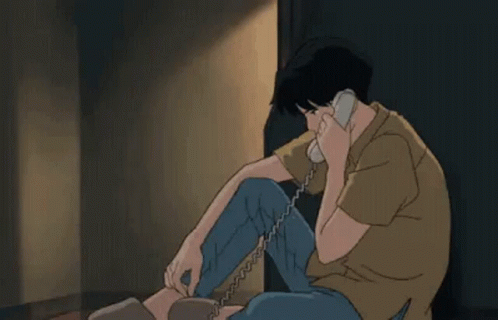

# Hello there 👋

 
 
 

# About ME 💬 :

### -1996 🇪🇬 , Bachelor of Information Systems and administrative

### - Learning :
- ✨ laravel
- ✨ Vue.js

### - Hobbies : 
- ✨ Gaming lover
- ✨ Anime watcher
- ✨ football player or i used to 😆

 
 
 

<!-- For more icons please follow  https://github.com/MikeCodesDotNET/ColoredBadges -->

# Languages & Tools 👨‍💻 🛠:
 

    

 
 
 

# Contact Me :

  

If you want to reach out to me about anything, be it some doubt or just to hangout and talk or want to game together just ping me 😉.

<a href="https://www.linkedin.com/in/eslam-abdallah-882480170/">
  
 
 
 
</a>
 

 

 
 
 
 
 
 
 

  
  
  

*************
